# Hi there, I'm fedes1to 👋

## About Me
I'm a passionate developer with a love for modifying games in a fun manner. I specialize in Android and Android Games.

- 🔭 I’m currently working on IL2Cpp decompilation
- 🌱 I’m currently learning C++ (2023)
- 👯 I’m looking to collaborate on Android modding projects
- 🤔 I’m looking for help with Mono.Cecil
- 💬 Ask me about Android modding
- 📫 How to reach me: Use Discord with this [link](https://discord.gg/RHyZAgxSSD)
- ⚡ Fun fact: I enjoy diving deep into Android internals and creating custom mods.

## 🛠️ Languages and Tools:
- 
- 
- 
- 
- 
- 

## 📈 GitHub Stats:

## 💡 Top Languages:

